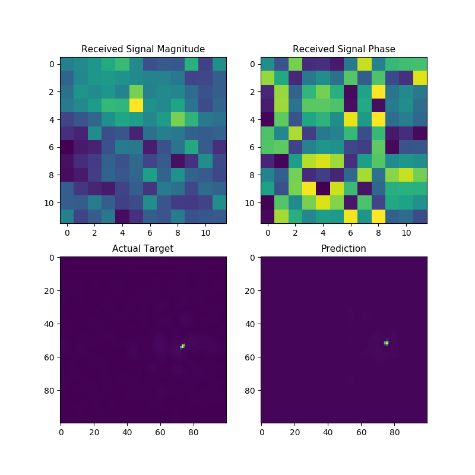

# Radar Imgaing with Deep Learning 

A convolutional neural network for  point target detection using reflected radar signal data transmitted and recieved by a MIMO antenna array. Please see the paper below for more details. 

- Cheng, Q, Ihalage A, et al. [Compressive sensing radar imaging with  convolutional neural networks](https://ieeexplore.ieee.org/abstract/document/9269977). IEEE Access, vol. 8, 2020.

## CNN Architecture





Please download the raw radar data from [figshare](https://figshare.com/articles/dataset/Radar_signal_data/21507093). Extract the zip file in the root directory and execute the code. This will train and evaluate the CNN on the dataset.

```
python DL_Radar_CS1.py
```

A denoising CNN is implemented to filter out the noise of traditional radar image reconstruction algorithms. The code may be executed as follows.

```
python DL_Radar_Denoise1.py
```
